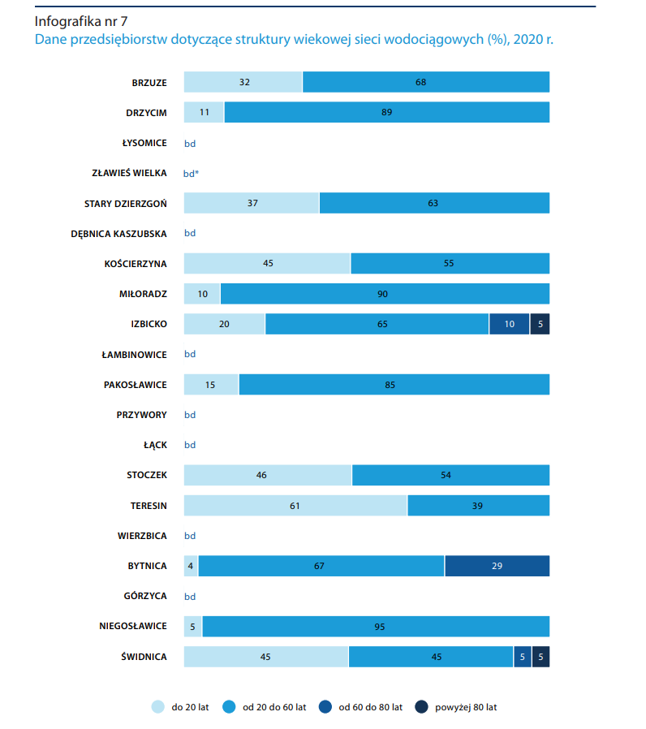
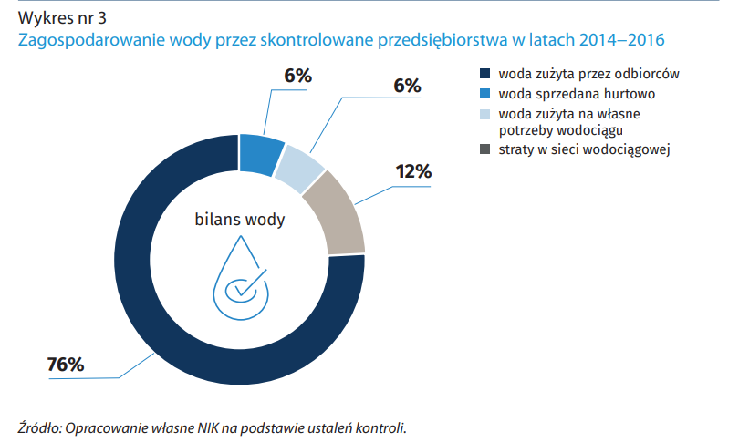

# Checkpoint 1 - Domain & Problem Analysis

*Authors' note: This report shares fragments with [EPANET optimization project](https://github.com/michwoj01/Computation-Intelligence---EPANET-optimization/wiki/Stage-1:-Analysis-of-the-problem-and-the-field) checkpoint 1 wiki page.*

_____

## Domain Analysis

Drinking water distribution systems connect water treatment plants or water sources (in the absence of treatment) to customers via a network of pipes, storage facilities, valves, and pumps. 
In addition to providing water for domestic use, distribution systems may supply water for fire protection, agricultural, and commercial uses.

Public water systems (PWSs) are responsible for operating and maintaining their distribution systems, which extend from the designated entry point to the distribution system (EPTDS) 
– typically the source or water treatment plant - up to the service connection, after which the piping is the property owner’s responsibility.

Distribution systems represent the vast majority of the physical infrastructure for water systems and serve as the final barrier against contamination. 
These systems must be operated and maintained to reduce the risk of contamination from external sources or internal sources such as 
microbial growth or corrosion within the system.

### State of polish waterworks
According to [Polish National Control Panel's (NIK) report](https://www.nik.gov.pl/plik/id,17663,v,artykul_16798.pdf) in 2015 Polish PWSs consisted of 8502 waterworks and 
provided water for around 36 mln people (92% of Poland's population).\
More importantly we have to consider the other message the report includes. In most of the Polish cities
nearly 50% of the waterworks systems are 25-50 years old! Furthermore, another 45% is over 20 years old! It's not the case for all cities, but we have to bear in mind
that on average around 75% of the cities' waterworks is consequentially old, older than the authors of the project to be exact. As usual the rural areas do not fair better in that metric.

    

Thereupon it shouldn't come as a surprise that the technical state of polish PWSs is poor. And such state is a result of years and years of the underfunding of the conservation and modernization
of the network as well as insufficient investment in the replacement of the eldest parts of the infrastructure. What is more, if the current rate of replacement is 
maintained it would take approximately 100 years to fully replace the whole system. It is debatable if we can even call such process an upgrade at all...\
In the last 20 years most of the funding for the PWSs came from the UE. In 2015 the whole budget reached 1.8 billion zł. If all of that wasn't bad enough, NIK's investigation in the following years suggests that there is a general lack of information regarding system's current state
and plans for its modernization and development are poorly built, researched and implemented.

_____

## Leaks problem analysis

Water loss from distribution system leaks and main breaks can result in lost revenue for the water system, wasted resources, and water quality concerns. 
Reducing water loss involves identifying and repairing breaches in the distribution system which, in addition to being sources of lost water, represent potential entry points for contamination to the system.

### Scale of the problem in Poland with examples

Different sources present different amount of water lost in the waterworks. In the aforementioned NIK's report in 2016 **the average loss in the PWS was 15.2%**, with the lowest rate being 4.15% achieved in Dębica, and the highest equal to 21.2% in Zduńska Wola.
 It's important to know that the investigation only included 12 cities across the country.

    

However, that's the case in the cities. The situation in the rural areas is even worse. In 2022 the [article from Polish newspaper - Dziennik Gazeta Prawna](https://serwisy.gazetaprawna.pl/samorzad/artykuly/8526291,nik-straty-wody-raport.html) claimed that
a [newer NIK's investigation](https://www.nik.gov.pl/plik/id,26438,vp,29229.pdf) from 2020-2021 conducted in several voivodeships found out that in over a half of the controlled communes **the losses surpassed 30%**, in 45% of the cases the loses were estimated at 45% of the water that has entered the systems, and
in 6 cases, the losses contributed to over 60%!

This state of affairs results in massive economical losses estimated at 21 mln zł, just from that one 2020-2021 report. Moreover, we cannot forget about the environmental consequences of such losses,
as Poland is considered a country with scarce water resources (24th in the UE in the renewable fresh water resources per citizen).

While the main reason for the losses is a bad technical state of the pipelines, not everything is as straightforward as it seems. When asked about the actions taken to prevent water losses, the local municipalities often answered that
with the current prices of water and received funding the costs of the waterworks fixes or replacements would massively outweigh the funds and would not repay for years to come.\
In 2016 NIK report, it was mentioned that out of the 12 investigated cities in 4 of them the local authorities did not have any data
regarding the loss of water in the waterworks. The lack of information was then used as another argument for not taking any action against the losses.

It's also important to consider that not all losses are caused by the bad technical state of the pipes. In rural areas some part of them is caused by theft as farmers illegally water their fields with the "liberated" water. 

For rural areas nearly all of those points were raised in [another NIK report](https://www.nik.gov.pl/aktualnosci/zmarnowane-miliardy-litrow-wody-na-wsiach.html) from 2022.

In conclusion:
* While different for each city and commune, the average water losses reach around 15% in the cities, and around 45% in rural areas.
* The main cause of the leaks is a bad technical state of the waterworks.
* The lack of data, planning and misplaced resources make it hard for municipalities to modernize or replace failing parts of the network. While not the only ones responsible, the local authorities fall victim to their own policies.
* Rural areas are more prone to the theft, which contributes to the higher loss in the aforementioned areas.
* The economical and environmental repercussions of such state of the PWSs are much more grave than most citizens think.

_____

## Short description of EPANET system

EPANET is a software application for understanding the movement and fate of drinking water constituents within a drinking water distribution system. It can be used to design and size new water infrastructure, retrofit existing aging infrastructure, optimize operations of tanks and pumps, reduce energy usage, investigate water quality problems, and prepare for emergencies.

What are its capabilities?:

* Ability to use pressure dependent demands in hydraulic analyses.
* System operation based on both simple tank level or timer controls and on complex rule-based controls.
* No limit on the size of the network that can be analyzed.
* Computes friction headloss using the Hazen-Williams, Darcy-Weisbach, or Chezy-Manning formulas.
* Includes minor head losses for bends, fittings, etc.
* Models constant or variable speed pumps.
* Computes pumping energy and cost.
* Models various types of valves, including shutoff, check, pressure regulating, and flow control.
* Allows storage tanks to have any shape (i.e., diameter can vary with height).
* Considers multiple demand categories at nodes, each with its own pattern of time variation.
* Models pressure-dependent flow issuing from emitters (sprinkler heads).
* Provides robust results for hydraulic convergence and low/zero flow conditions.