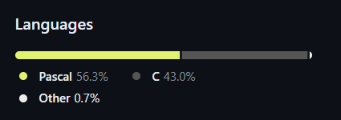

# Checkpoint 2 - Analysis of EPANET simulator and optimization librarie

## Optimization software

In the context of the EPANET leakage problem, optimization tools can be sought in the following categories:

a) Nonlinear programming (NLP): problem can be formulated as a nonlinear optimization problem, where the goal is to minimization of the objective function. This optimization can take into account various factors, such as the locations of potential leaks, flows in individual pipe sections, network pressures and repair costs.

b) Integer programming (IP): decisions on where to locate sensors to detect leaks can be formulated as integer programming problems. For example, IP can be used to select the optimal number of sensors and their locations to minimize the cost of leak detection.

c) Multi-objective optimization (multi-criteria programming): simultaneously considering various optimization objectives, such as minimizing water loss, minimizing repair costs, minimizing disruption to users, or minimizing the time required to detect and repair a leak.

d) Heuristic algorithms: Due to the complexity algorithms such as genetic algorithms, ant algorithms or particle swarm algorithms could be used. These methods can be useful for searching the solution space and finding near-optimal solutions, especially for large and complex water supply networks.

What tools could be used in our problem? Let us take a look

### Optimization applications/environments

1. AD Model Builder - suite for non-linear statistical modeling. The "AD" refers to the automatic differentiation capabilities that come from the AUTODIF Library, a C++ language extension (same author), which implements reverse mode automatic differentiation. A related software package, ADMB-RE, provides additional support for modeling random effects. Useful for Bayesian modeling

2.  CUTEr - testing environment for optimization and linear algebra solvers. CUTEr provides a collection of test problems along with a set of tools to help developers design, compare, and improve new and existing test problem solvers:
* linear programming,
* convex and nonconvex quadratic programming
* linear and nonlinear least squares
* more general convex and nonconvex large-scale and sparse equality and inequality-constrained nonlinear programming

3. Octeract Engine - solver for general Mixed-Integer Nonlinear Programs (MINLP), uses Message Passing Interface as a means of accelerating solution times:
* distributed computing through MPI
* high degree of configurability with more than 100 options
* supports discontinuous elementary and trigonometric functions
* can guarantee global optimality
* detection of special structure
* automatic problem classification

4. GNU Octave - free, open-source MATBLAD alternative, programming language for scientific/numerical computing, solves linear and nonlinear problems

5. Scilab - another MATLAB alternative, numerically oriented programming language, could be used for:
* signal processing
* statistical analysis
* image enhancement
* fluid dynamics simulations
* simulation of explicit and implicit dynamical systems

6. GAMS - paid, only free trial
7. MOSEK - paid, only free trial

### Optimization libraries

1. SciPy - probably most popular optimization lib for Python, covers all problems categories
2. OpenMDAO - platform for systems analysis and multidisciplinary optimization; gradient based optimization with analytic derivatives
3. CVXPY - open source Python-embedded modeling language for convex optimization problems, less-strict syntax for solving problems
4. Pyomo - collection of Python software packages for formulating optimization models, supports dozens of solvers (algebra - AMPL, mixed integer - CBC, liner - GLPK), allows seperation of model and data, object-oriented style of formulating models
5. GNU Linear Programming Kit - mainly large-scale linear programming (LP) and mixed integer programming (MIP), uses revised simplex method and the primal-dual interior point method for non-integer problems and the branch-and-bound algorithm together with Gomory's mixed integer cuts for MIP
_________

## EPANET System

**Basic Information:**
* Written in: Mostly Pascal and C
<p align="center">
    
</p>

* License: MIT License
* Latest version: [EPANET 2.2.0 from 24th July 2020](https://github.com/USEPA/EPANET2.2/releases/tag/2.2.0)

_________________

**Launching the system**

*Author's note: When launching the system in both cases we used the example network from the tutorial provided on [read the docs of EPANET](https://epanet22.readthedocs.io/en/latest/2_quickstart.html).*
<p align="center">
    
</p>

The installation process was super simple and consisted of downloading the installation wizard and following its instructions.\
When following the tutorial we've also established some default values as follows:
* **ID Labels/ID increment**: 1
* **Hydraulics/Flow Units**: GPM (gallons per minute) - *might later be changed to LPM (liters per minute) to match our data and metric system better*
* **Hydraulics/Headloss Formula**: H-W (Hazen-Williams [described more here](https://epanet22.readthedocs.io/en/latest/3_network_model.html))

___________________

**with GUI**

After the set-up we drew the network in the GUI and then exported it to source file in [binary](/knowledge_sources/epanet_usage_examples/example_network.net) or [readable](/knowledge_sources/epanet_usage_examples/example_network_readable.inp) version that we could use later when launching the app from the command line (useful feature).
The ability to create your network in GUI really makes your life easier as the file representing it has a lot of options and requires high level of understanding of the system.
However, it's also worth mentioning that there is a certain amount of effort required to understand and learn the tool regardless of the way you want to use it, 
as the networks and the tasks simulated by the tool can get really complex.

<p align="center">
    
    <br/>Creating the nodes in our example network
</p>

<p align="center">
    
    <br/>Example network after adding the pump, pipes and labels
</p>

<p align="center">
    
    <br/>Editing nodes and pipes properties
</p>

Later on, following the tutorial, we ran a Single Period Analysis and an Extended Period Analysis

<p align="center">
    
    <br/>Pressure on the nodes marked by colors and statistics from the single pipe as a result of the SPA.
</p>

<p align="center">
    
    
    
    <br/>Several aspects of setting-up the EPA
</p>

Because the network properties were different in tutorial's tables and texts as well as different from command line tutorial example input file, it was hard to obtain a coherent model. 
This resulted in warnings during the Extended Period Simulation

<p align="center">
    
    <br/>Warnings from the EPA
</p>

Below we can see some of the possible ways to inspect the simulation

<p align="center">
    
    <br/>Pressure at the Tank at the end of the network during the EPA - we can create graphs for various network elements (junctions, reservoirs, tanks, pipes) regarding different parameters such as pressure, demand, quality etc. 
that  differ for different types of elements.
</p>

<p align="center">
    
    <br/>View of various statistics on the network model during the period of the simulation
</p>

<p align="center">
    
    <br/>View of various statistics in the table form, also highly customizable
</p>

_______________________

**from the command line**

The system can be launched from the command line with the following command:

```runepanet  inpfile  rptfile  outfile```

where:
* **inpfile** - input file with network parameters in the same format as a [readable](/knowledge_sources/epanet_usage_examples/example_network_readable.inp) version exported from GUI. The format of the file is described in depth [here](https://epanet22.readthedocs.io/en/latest/back_matter.html#input-file-format)
* **rptfile** - output report file, which yields the result of EPA ran with settings specified in an input file
* **outfile** - optional binary output file that stores the result in a special binary format

As written, the above command assumes that you are working in the directory in which EPANET was installed or that this directory has been added to the system PATH variable. 
Otherwise full pathnames for the executable runepanet.exe and the files on the command line must be used.


We tried this version of launch for the example network created when using the GUI. The command was as seen below:

```runepanet D:\sem8\MiSS\projekt\MiSS-EPANET-Leaks-in-waterworks-research-project\knowledge_sources\example_network_readable.inp D:\sem8\MiSS\projekt\MiSS-EPANET-Leaks-in-waterworks-research-project\knowledge_sources\example_network_readable_report.txt```

And the command line output was as follows

<p align="center">
    
</p>
_________________

**System's output**

The report file obtained from command line launch of the system can be seen [here](/knowledge_sources/epanet_usage_examples/example_network_readable_report.txt). The amount of information can vary depending on the configuration
of the [REPORT] section in the input file.

_________________

**How can we use the system for our problem**

The main idea is to reach conclusions about the locations of the leaks by comparing the actual data from the waterworks with the results of EPANET EPA.
If there are differences in the compared data we can model the behaviour of the leak ([section 2.1 in the linked paper](https://www.researchgate.net/publication/326823790_Pre-Localization_Approach_of_Leaks_on_a_Water_Distribution_Network_by_Optimization_of_the_Hydraulic_Model_Using_an_Evolutionary_Algorithm#pf2)) in place where we suspect it in EPANET network and run the analysis again.
By repeating this process until we reach the desired equality of the simulated & real data we can to some extent locate the leaks and get to know their severeness.

The [linked paper](https://www.researchgate.net/publication/326823790_Pre-Localization_Approach_of_Leaks_on_a_Water_Distribution_Network_by_Optimization_of_the_Hydraulic_Model_Using_an_Evolutionary_Algorithm#pf2) provides its own idea on how to pre-locate
the leaks and how to estimate them with the usage of Genetic Algorithms. The parameters to be compared proposed by the paper are the pressure and the flow rate in junctions / measure points.

[Another paper](https://dwes.copernicus.org/articles/13/29/2020/dwes-13-29-2020.pdf) bases their leak pre-location on a Random Forrest machine-learning algorithm, but the training data it uses is obtained through
a very similar method to the one described in the former work.

_________________

**Possibilities of integration with optimization libraries**

For Michał??? or us both?

___________________

### Summary

* EPANET is a tool that allows us to build a network from a variety of components including tanks, reservoirs, pipes and junctions.
* Each of these components has various properties that can be customized to our need
* On such network we can run extended period analysis which will simulate the behaviour of the network based on established demand patterns that can be different for different parts of the waterworks
* Then we can inspect the results of the analysis through various tools such as tables, graphs and a simple visualization or generate a complete textual report of the analysis
* When launching the system from the command line all network and analysis parameters have to be included in the input file which "manages" the analysis process
* The output of cmd launch is a report file which contents are based on the \[REPORT] section in the input file.
* Based on this report we can formulate hypothesis about the system including comparing the report with the actual data to try and locate the leaks in the waterworks
