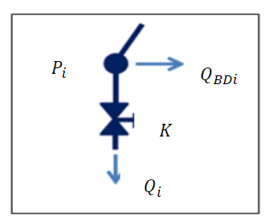

# Checkpoint 3 - Test launching of the simulator and confirmation of the objectives and the scope of work

### Confirmed scope of work

It has been decided that our initial task of combining EPANET with an optimization library will be to localize an artificially created hole in the waterworks
with the use of the optimization library.

This process can be separated into several sequential parts:
1. Put a hole(s) in an arbitrary place (chosen by the participants) and run the extended period analysis (EPA) with EPANET
2. Save the EPA results and remove the hole(s)
3. Make the optimization library estimate the placement of the hole(s) by running the experiments with holes in places pointed by the lib and comparing the results with the data obtained in the 1st part of the task until an agreed level of similarity is reached.

To perform the task we will need several auxiliary scripts that will smoothen the cooperation between the optimization library and the EPANET. Those scripts will:
1. Add a hole (or holes) to the EPANET network model and create a new input file
2. Parse the epanet report file into a format readable by the library 
3. Connect the work of the library with subsequent launches of the EPANET
____
### Modelling a hole in EPANET

At first we researched the internet as well as [read the docs of EPANET](https://epanet22.readthedocs.io/en/latest/2_quickstart.html) to check if it's possible to model a hole directly. Should that be impossible we will use one of the methods described in the papers mentioned in the [checkpoint2](checkpoint2.md).

The search for the in-built hole implementation in EPANET 2.2 proved unsuccessful, even the docs of EPANET state that *"Emitters are used to model flow through sprinkler heads or pipe leaks."*. Because of that it was decided to go through with the leakage simulation applied in [Pre-Localization Approach of Leaks on a Water Distribution Network by Optimization of the Hydraulic Model Using an Evolutionary Algorithm paper](https://www.researchgate.net/publication/326823790_Pre-Localization_Approach_of_Leaks_on_a_Water_Distribution_Network_by_Optimization_of_the_Hydraulic_Model_Using_an_Evolutionary_Algorithm#pf2) that has benn mentioned in the previous checkpoint.
This course of action was chosen because that method assumes that **the leak depends on the pressure**, which is a key constraint in our project.

The leakage is modeled by an **emitter**, which presents an open valve to the atmosphere. Unlike a standard
EPANET valve which is a link between two nodes, the emitter is a simple node element.
Therefore, using emitters does not needlessly increase the model complexity with additional
new nodes. 

The schema from the paper looks as follows

    

Where:
* $Q_{BDi}$ is the base node demand
* $P_{i}$ is the node pressure
* $K$ is the flow coefficient of the valve
* $Q_{i}$ is the flow rate of the valve representing the leakage.

The emitter behaviour can be described by an equation:
$$Q_{j} = K_{j}P_{j}^N$$
where:
* $Q_{j}$ is the leakage flow rate at node *j*
* $K_{j}$ is the emitter coefficient
* $P_{j}$ is the pressure at the aforementioned node
* $N$ is the pressure exponent, which depends mostly on the predominant pipe material (0.5 for metallic pipes, 1.2 or greater for plastic
pipes, and about 1.0 for different materials more or less equally combined)

This method of leakage modeling was described in detail [in the other, older paper](https://typeset.io/pdf/including-leakage-in-network-models-an-application-to-464k8qzkp6.pdf).

As planned we've created a script that adds those leakage simulating emitters to the network input file. The code is available [here](scripts/add_leaks.py).

____
### Attempts at hole discovery with EPANET and \<optimization lib name>