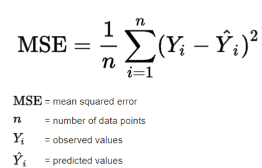

# Checkpoint 4 - Prototype and first working elements

### Confirmed scope of work

As discussed, the work to be performed for this checkpoint includes the following tasks:
* Changing the monitored node parameter from *Demand* to *Pressure*, since real gauges usually measure only the latter.
* Adjusting the cost function to really represent the MSE.
* Creating and testing a specific scenario for leak detection with the usage of the optimization algorithm. Including **the selection of 1 leakage point and 4 measure points**. The amount of the latter
is limited to better model the real life restrictions, since not every node in the network has monitoring devices. Later we will run the simulation to produce the data from the arbitrarily created leakage and use it as a baseline for the optimization algorithm, 
which goal would be to recognize the node at which the leakage is located, and it's coefficient, so that the difference between the baseline measurements and the ones obtained after the optimization is as small as possible.
* Initial work aimed at creating a new script adding more advanced leakages. Currently, we are only able to add leakages at nodes via emitters. Newest version will be able to produce a "fake" node at a specified distance between two selected junctions and add emitter with input coefficient to such node,
thus modelling the hole in the pipe more accurately.

___
### Cost function adjustments

The original formula for the Mean Squared Error is pretty straight-forward:

    

However, in our case we had to consider the fact that during the simulation we obtain data for each node not as a single value, but as a sequence of values representing the gauge's outputs for each hour of the simulation.
Thus, we accommodated the cost function formula, so that the $Y_{i} - \widehat{Y_{i}}$ was changed to represent the mean of the squared differences between measurements and "true" values on the same node on each hour during the simulation.

Because of that the cost function formula evolved as such:

$$ Cost = \frac{1}{n} \sum_{i=1}^n (\frac{\sum_{j=1}^k (y_{i,j} - \widehat{y_{i,j}})^2}{k}) $$

where:
* $Cost$ &rarr; the error estimated during an optimization step
* $n$ &rarr; number of the nodes that monitor the changes in the network
* $k$ &rarr; number of hours in the simulation
* $y_{i,j}$ &rarr; observed value in node i on hour j
* $\widehat{y_{i,j}}$ &rarr; "real" value in node i on hour j

___
### Testing optimization for a created scenario

Arbitrarily chosen points:
* **Leakage point: SD19**
* **Measure points: HP12, HP5, SW20, SW/K01**

The leakage was added with the `add_leaks` method and the measure points were added to the input file with the newly created script [add_observators](../scripts/add_observators.py) which was written for this specific purpose.
The baseline data can be looked up [here](../knowledge_sources/checkpoint4_experiments/.gitkeep).

The optimization was performed with the usage of the XXX algorithm.

The results are as follows:

YYY

___
### Adding advanced holes to the network model

As this work is to be continued throughout the following checkpoints, it will be described in more detail later on. Current progress can be seen in the [add_leaks file](../scripts/add_leaks.py). The function name is `add_advanced_leaks`.