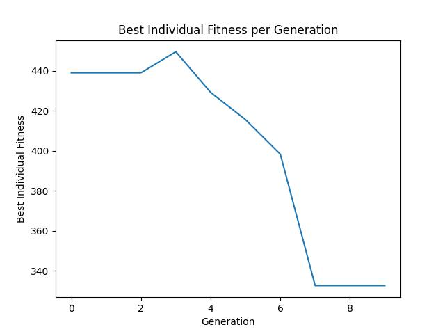
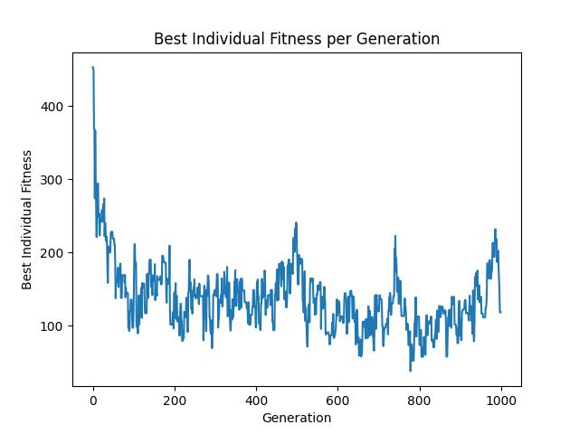
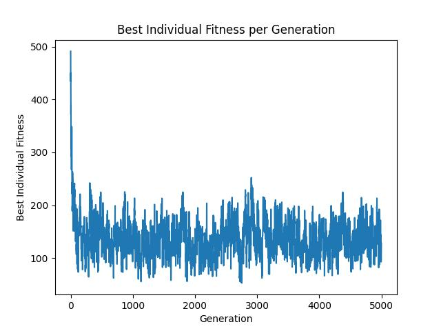
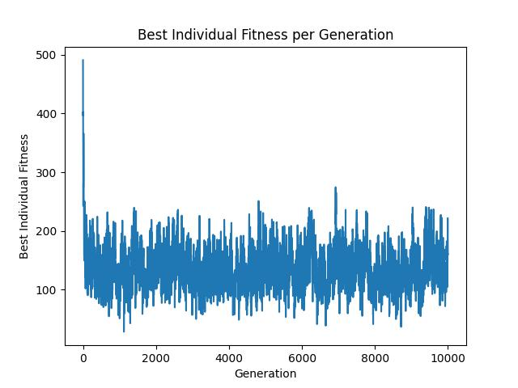

We have implemented the following changes to our algorithm:
- we introduced concurrency using the scoop library (parallelizing the evaluation function across all logical processor cores)
- we changed the crossover function: for each attribute of an individual, we draw two division points (one for distance, one for coefficient) and according to this we copy the values from the parents to the two descendants (symmetrically, of course)
- we added saving the best score of an individual in the population after each iteration 

After these changes, results are as follows:

Finally, we get access to AGH Ares resources. After little support from the helpdesk, we managed to run epanet as a module, so we could request for 48 vCPU and 32GB of RAM and run our algorithm on it. The results are as follows:
- 1st run (1k iterations): 
- 2nd run (5k iterations): 
- 3rd run (10k iterations): x

Unfortunately we were not able to run the algorithm for 10k iterations, because the job was killed by the system after 3 hours of running. We tried to run once more, but our job was queued for too long. If given more time, we would try to run the algorithm for even more iterations to see if the results would improve.

Nevertheless, the results for 1k and 5k iterations looks almost the same. After coming down from a very large fitness (400-500) in few first iterations it starts to oscilating between 100 and 200 and does not improve. It is hard to say if crossover function is not good enough or mutation one has some errors. If we look on raw results for each run (list of pipes with non-zero coefficient), our 'real leaks' are not distinguished from the rest of the pipes. We would like to try to improve the algorithm in the future, but we are out of time now.